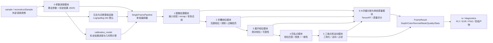

# Legacy 单帧重构模块化重构概要设计

> 文档日期：2026-07-09
> 项目：`D:\code\reconstructOneFrame`
> Legacy 基线：`D:\code\reconstructOneFrame\legacy\teethscanalgorithm3x4` / `D:\code\teethscanalgorithm3x4`
> 参考工程：`D:\code\slam` 的 JSON 参数加载、日志封装、运行诊断模式
> 阶段定位：概要设计，不进入实现。

## 1. 背景与目标

`reconstructOneFrame` 的目标不是把 Legacy 单帧算法等价搬迁，而是重构为清晰、可测、可诊断、可 CUDA 优化、便于下游集成的单帧结构光重建框架。Legacy 目前以 `Reconstruct::init()` 和 `Reconstruct::reconstructOne()` 为中心，主流程同时承担参数持有、标定结果读取、图像检查、相位求解、相位展开、同名点/视差匹配、三维重建、法向计算、AI 分割、质量图生成和调试输出，导致接口长、状态隐式、诊断分散、热路径开销难控。

新设计要求：

- 模块边界清晰，每个模块只通过显式输入、输出、状态码和配置交互。
- CUDA 作为相位、unwrap、匹配、重建、质量图等高吞吐路径的优先实现。
- 参数读取和日志能力成为基础设施，不散落在算法模块内部；日志直接仿照 `D:\code\slam` 引入第三方 Log/spdlog，默认 `info` 等级。
- 标定由外部项目 `D:\code\manufacturing-process-monitoring-system` 产生，本项目只读取和验证标定 JSON，不承担标定计算职责。
- 外部调用适配优先面向可链接的稳定 C/C++ 接口，同时兼容并逐步替代 DSSI 现有热加载 Legacy DLL 的使用方式。
- Legacy 已有能力必须被覆盖或有明确替代说明，但不复制其历史包袱。
- 每个阶段输出可被独立验证，失败时能定位到具体模块、状态码和关键统计。

## 2. Legacy 当前行为摘要

Legacy 的重要输入与行为来自以下位置：

- `Config`：集中保存标定路径、图像尺寸、频率、相位、匹配、AI、输出和调试参数。
- `GPUPhaseUnwrapper`：负责左右图像 GPU 上传、remap、过曝/低亮统计、三角求和、包裹相位、两阶段或直接三频 unwrap、调试 map。
- `computePointCloudFromPhase`：负责从左右绝对相位匹配到点云、法向和质量信息，接口包含匹配、窗口、唯一性、左右一致性、局部一致性、质量图和调试输出参数。
- `DualStreamPPLiteSeg`：TensorRT 分割后端，用于 AI 牙龈分割。
- `TemporalSequenceValidator` / `ProjectorDefocusQuality`：连续帧顺序、残差、离焦质量等质量诊断能力。
- `teeth_log::ScopedLogSession`：本地日志适配，隔离第三方 `Log.h`。

新设计吸收这些能力，但拆分职责：编排器不再直接持有所有参数和中间状态，计算模块不负责文件读取和长期日志策略。

## 3. 总体架构

### 3.1 模块图



### 3.2 建议目录

```text
src/
  sample/
    reconstructSample.cpp # 外部调用用例，不作为核心库入口
  config/                 # 读取 reconsAlgPara.json，做强类型映射、校验和兼容迁移
  logging/                # 仿照 Slam 引入第三方 Log/spdlog，默认 info 等级
  diagnostics/            # StageStats, timers, debug artifact routing
  io/                     # image/calibration-json/stage-output readers and writers
  calibration_model/      # 读取外部标定结果，构建 rectification maps / Q / projection/ray contracts
  image/                  # input validation, remap, color merge, exposure/basic masks
  phase/                  # wrapped phase, unwrapped phase, phase reliability
  matching/               # correspondence search, disparity, LR consistency, DP/uniqueness
  reconstruction/         # triangulation, point cloud, normal, filtering
  ai/                     # TensorRT segmentation wrapper and semantic masks
  quality/                # single-frame score, temporal/projector defocus adapters
  pipeline/               # SingleFramePipeline orchestration and buffer ownership
include/reconstruct_one_frame/
  reconstructInterface.h  # stable external API only
config/
  reconsAlgPara.json      # 直接沿用 Legacy 算法配置文件名和主要字段，逐步内部强类型化
```

说明：

- `src/sample/reconstructSample.cpp` 只展示外部如何初始化、传入条纹数组、接收 `depth/color/normal/qualityInfo`，不承载核心业务逻辑。
- `src/calibration_model/` 不是“标定模块”。它不拍标定图、不检测圆点、不优化内外参，只读取 MPS 输出的 `calibResult.json` 并派生本项目运行所需的几何对象。
- `config/reconsAlgPara.json` 直接搬用 `D:\code\teethscanalgorithm3x4\config\reconsAlgPara.json` 作为第一阶段配置入口；不新增 `default.json` / schema 文件作为前置条件。后续若要做 schema，也只能作为校验辅助，不能替代现有配置入口。

## 4. 公共数据契约

### 4.1 基础类型

- `FrameId`：输入帧序号、采集组序号、左右相机标识和时间戳。
- `ImageView`：只读图像视图，包含 width、height、type、channels、stride、camera、semantic、memory location。
- `StripeImage`：单张条纹图，包含频率索引、相移索引、相机侧、投影序号、图像视图和可选曝光/光强元数据。
- `GpuImageBuffer`：设备端图像 buffer，明确 owner、stream、pitch、dtype、lifetime。
- `StageStatus`：状态码、模块名、严重级别、消息、统计摘要。
- `StageStats`：耗时、有效像素、拒绝像素、NaN/Inf、过曝、低亮、质量分布、CUDA kernel 时间。
- `FrameDiagnostics`：按模块收集 `StageStats`，可选记录调试产物路径。
- `FrameResult`：深度/XYZ、color、normal、semantic mask、quality map、质量评分、状态码与统计。

### 4.2 输入帧组

```cpp
struct StripeFrameGroup {
    FrameId id;
    int width;
    int height;
    std::vector<StripeImage> leftStripes;
    std::vector<StripeImage> rightStripes;
    ImageView color;         // optional RGB/BGR source for output color binding
    ImageView leftColor;     // optional, for merge/preview/AI if needed
    ImageView rightColor;    // optional
};
```

约束：

- 灰度条纹输入优先 `float32`，范围统一为 `[0, 255]` 或配置声明的 normalized range。
- 输入只约定为“纯数组 + 每张图元数据”。不要在公共输入结构里固定 `freqCount` / `stepCount`，因为不同频率可能使用不同相移步数，例如部分频率 3 步、部分频率 5 步。
- 相位模块根据 `reconsAlgPara.json` 的频率计划从数组中选择所需条纹；warmup、额外 preview 或设备私有帧必须通过 `StripeImage` 元数据显式标记，不能靠数组位置隐式混入。
- 输入校验模块必须标记空图、黑图、尺寸不一致、类型错误、通道错误、非有限值比例异常、过曝比例异常。

### 4.3 中间结果

- `ImagePreprocessResult`：标准化后的左右条纹数组、颜色图、输入有效 mask、曝光统计、连续帧检查摘要；是否输出校正后条纹由参数决定。
- `WrappedPhaseResult`：每频率包裹相位、modulation、fit residual、sin/cos sum、高频 light flags。
- `UnwrappedPhaseResult`：左右绝对相位、unwrap integer / k map、相位可靠性 mask、残差 map、失败原因 map。
- `CorrespondenceResult`：右图同名点坐标、视差/候选数量、best/second-best cost、LR consistency、matching mask。
- `ReconstructionResult`：`CV_32FC3` XYZ/depth、`CV_32FC3` normal、raw/nofill point map、valid mask、过滤统计。
- `QualityResult`：AI semantic mask、单帧质量 score、label、分项指标、是否可送入下游 SLAM/融合。

## 5. 状态码设计

状态码使用稳定枚举，不用 `bool` 表达复杂失败：

```cpp
enum class ReconsStatusCode {
    Ok = 0,
    InputMissing,
    InputEmptyImage,
    InputBlackImage,
    InputTypeMismatch,
    InputSizeMismatch,
    ConfigMissing,
    ConfigParseFailed,
    ConfigInvalidValue,
    CalibrationMissing,
    CalibrationParseFailed,
    CalibrationInvalidGeometry,
    CudaUnavailable,
    CudaAllocationFailed,
    CudaKernelFailed,
    ImageQualityInsufficient,
    WrappedPhaseFailed,
    UnwrapFailed,
    CorrespondenceInsufficient,
    LeftRightConsistencyFailed,
    ReconstructionPointCountTooLow,
    NormalInvalid,
    AiModelMissing,
    AiInferenceFailed,
    QualityRejected,
    OutputWriteFailed,
    InternalInvariantFailed
};
```

每个模块返回：

```cpp
template <typename T>
struct StageResult {
    ReconsStatusCode code;
    T value;
    StageStats stats;
    std::string message;
};
```

生产路径中 `Warning` 类状态允许输出降级结果；`Error` 类状态停止后续依赖模块，并在 `FrameResult` 中保留已完成阶段统计。

## 6. 模块设计

### 6.1 0 参数读取模块

职责：读取、合并、校验和冻结运行参数。包含算法参数和外部标定结果路径，但二者要分层：算法参数描述处理策略，标定结果描述几何事实。本项目不执行标定。

输入：

- 默认算法 JSON：`config/reconsAlgPara.json`，第一阶段直接搬用 `D:\code\teethscanalgorithm3x4\config\reconsAlgPara.json` 的文件名和主要字段。
- 用户算法 JSON 文件、JSON 字符串或内存 JSON 对象。
- 标定结果 JSON：来自 `D:\code\manufacturing-process-monitoring-system` 的 `calibResult.json`。Res1F 不接受 `.yml/.yaml` 路径或 YAML 内容；`calibParams.yml` 只供外部 Legacy 实现读取。
- 可选环境变量覆盖：只允许 runtime/logging/diagnostics 类开关，避免热路径算法参数被不可追踪地改写

输出：

- `RuntimeConfig`
- `CalibrationResultConfig`
- `ConfigDiagnostics`：参数来源、默认值覆盖表、非法值、版本迁移记录

设计细节：

- 参考 `D:\code\slam` 的 `LoadAlgParamsFromFile` / `LoadAlgParamsFromJson` / `LoadAlgParamsFromString` 三入口模式。
- 第一阶段保持 `reconsAlgPara.json` 的 Legacy key 兼容；内部转换为强类型配置对象，缺失字段使用 Legacy 默认值，类型错误和越界值返回明确状态。
- 不额外引入 `reconstructOneFrame.default.json` 和 `schema/reconstructOneFrame.schema.json` 作为必需文件。若后续需要 schema，只作为自动检查和文档生成辅助。
- 参数分节可以在内部强类型对象中整理为：`runtime`、`logging`、`calibrationResult`、`image`、`phase.wrapped`、`phase.unwrap`、`matching`、`reconstruction`、`ai`、`quality`、`diagnostics`、`output`。
- 初始化时可打印参数快照，但必须可关闭；快照写入日志或 `diagnostics/config_effective.json`，便于复现。
- 标定 JSON 加载后立即生成 `CalibrationModel`，预计算可选 remap、投影/反投影矩阵、右到左变换、Z 窗口对应 disparity 范围，不进入逐帧热路径。

配置校验重点：

- `image.size == calibrationResult.imageSize` 或存在明确 resize/remap/canvas 策略。
- 频率计划支持每个频率独立声明相移步数，不能只用全局 `freqCount * stepCount` 推导输入长度。
- `minZ < maxZ`，disparity window 范围落在重建 Z 范围内。
- TensorRT 模型路径存在时才启用 AI；缺失时返回 `AiModelMissing` 或按配置关闭 AI。
- 所有 debug/stage output 默认关闭，输出目录必须可创建。

### 6.2 日志与诊断基础设施

职责：统一日志生命周期、等级、轮转、结构化阶段统计和诊断产物路径。算法模块只记录事件，不直接控制第三方 logger。

参考：

- `slam` 的 `InitializeLog`：时间戳日志、保留最近 10 个、设置 spdlog level。
- Legacy 的 `teeth_log::ScopedLogSession`：用 repo-local adapter 隔离 `Log.h`，避免第三方宏污染算法代码。

设计：

- `logging::LogSession` 在 sample、DLL 初始化或下游静态链接入口处创建，直接复用第三方 Log/spdlog。默认等级为 `info`，默认显示关键初始化和逐帧 summary。
- 日志文件命名：`logs/log_<tag>_<YYYY-MM-DD_HH-MM-SS>.log`。
- 保留策略：按 mtime 删除旧文件，默认保留 10 个，可配置。
- 热路径日志默认只允许阶段级 `info` 汇总和异常 `warn/error`；逐像素、候选、直方图类信息进入 `FrameDiagnostics`，不刷日志。
- `StageTimer` 支持 CPU wall time、CUDA event time、H2D/D2H 拷贝时间、kernel 分项时间。
- 每帧可选输出一行结构化 summary：`FRAME_METRIC frame={} status={} total_ms={} valid_points={} phase_valid={} match_valid={} ai_score={}`。

### 6.3 1 图像处理模块

职责：把采集帧组转为标准化、已校验、可进入 GPU 热路径的输入。

输入：`StripeFrameGroup`、`ImageConfig`、`CalibrationModel`。

输出：`ImagePreprocessResult`。

设计细节：

- 输入正确性检查：空指针、空图、尺寸、类型、通道、stride、连续性、非有限值、全黑/近黑、过曝比例、左右帧数一致性。
- 连续帧检查吸收 `TemporalSequenceValidator` 的能力：相位顺序、频率顺序、相邻采集组跳变、残差坏点比例，作为可选诊断，不阻塞默认生产路径，除非 `quality.rejectBadTemporalSequence=true`。
- 彩色图像合成：支持来自左相机、右相机、双目融合或外部 RGB；输出 `CV_8UC3`，明确 BGR/RGB 语义。
- 校正策略由参数选择：`none`、`rectifyKeepInputSize`、`rectifyExpandedCanvas`。默认设计应优先考虑不浪费输入信息，允许使用扩充画布；是否保持原始输入大小必须由下游接口和性能预算共同决定。
- 若启用 remap/校正，逐帧使用初始化阶段预计算 map；生产路径不得重复搜索 rectification canvas 或重建 map。
- `rectifyKeepInputSize` 兼容 Legacy/DSSI 固定 424x400 这类接口；`rectifyExpandedCanvas` 用于保留畸变校正后边缘信息，输出尺寸写入 `ImagePreprocessResult` 并传递给后续相位/匹配/重建模块。
- 输出 mask：区分 `input_valid_mask`、`exposure_mask`、`temporal_quality_mask`，不要把不同原因合并为不可诊断的单一 mask。

CUDA/CPU 分工：

- CUDA：批量 normalize、过曝/低亮统计、可选 remap、mask 生成、颜色 resize/merge。
- CPU：输入元数据检查、文件读取、诊断统计汇总、少量配置判断。

### 6.4 2 计算折叠相位模块

职责：从多频多步条纹图计算每个频率的包裹相位、调制、残差和曝光/低亮质量信息。

输入：图像处理模块输出的左右条纹 GPU buffer、`PhaseWrappedConfig`。该 buffer 可以是原始画布、保持原始尺寸的校正画布，或扩充校正画布，取决于图像处理参数。

输出：`WrappedPhaseResult`。

设计细节：

- 保留 Legacy 三角求和思路：每频率计算 sin/cos sum，输出 `wrapped_phase[f]`。
- 不假设理想正弦或理想 gamma；通过 modulation、fit residual、过曝/低亮 mask 表达质量。
- `phase_step_direction` 成为显式参数，写入 config snapshot。
- 高频 light flags 作为质量和后续匹配辅助信号，而不是隐藏在 `GPUPhaseUnwrapper` 内部。
- 输出每频率 `modulation_map` 和 `fit_residual_map`，供 unwrap 和质量模块复用。

CUDA/CPU 分工：

- CUDA：sin/cos sum、包裹相位、modulation、residual、过曝低亮统计。
- CPU：小规模参考实现，用于单元验证和 CUDA 数值对比。

### 6.5 3 计算展开相位模块

职责：把多频包裹相位转为左右绝对相位，并输出可靠性和失败原因。

输入：`WrappedPhaseResult`、`PhaseUnwrapConfig`。

输出：`UnwrappedPhaseResult`。

设计细节：

- 支持两条策略：`legacyTwoStage` 作为基线可对比路径，`directThreeFrequency` / `directLs` 作为新优化路径。
- 展开结果必须输出 `absolute_phase`、`k_map`、`residual_map`、`reliability_mask`、`reason_map`。
- 质量门控分离为可组合规则：最小调制、最大拟合残差、频率有效数、高频是否必须有效、连续性梯度、邻域支持。
- 中值滤波、support filter 等后处理必须有明确开关和统计，避免静默改变指标口径。
- 对低纹理、饱和、局部跳变、频率冲突要给出可统计的 reject reason。

CUDA/CPU 分工：

- CUDA：主 unwrap、残差、可靠性 mask、邻域支持统计。
- CPU：直解/LS 的参考版本、调试输出、离线验证。

### 6.6 4 计算同名点模块

职责：基于左右绝对相位和标定几何，寻找同名点或视差，输出候选质量和一致性诊断。

输入：左右 `UnwrappedPhaseResult`、`CalibrationModel`、`MatchingConfig`、可选 semantic/input mask。

输出：`CorrespondenceResult`。

设计细节：

- 生产默认优先快速 disparity/极线搜索路径；epipolar arc / LS / DP 作为可选策略，不默认进入热路径。
- 候选选择输出 best cost、second-best cost、gap、candidate count；唯一性门控不得只返回“无效”。
- 支持左右一致性：左到右匹配后，再用右相位反查左坐标，误差超过阈值标记为 `LeftRightConsistencyFailed` 或像素级 reason。
- 支持局部连续性：邻域 disparity 跳变、候选数量异常、低支持区域单独统计。
- semantic mask 可以降低牙龈/非牙区域权重或直接剔除，但不能在匹配模块内部调用 AI。

CUDA/CPU 分工：

- CUDA：每像素候选搜索、cost 计算、唯一性/LR/局部一致性 mask。
- CPU：少量 DP、行级调试、候选 CSV/图输出。

### 6.7 5 计算三维点和法向量模块

职责：把同名点/视差转换为左相机坐标系下的 XYZ，计算法向、过滤离群点并绑定颜色。

输入：`CorrespondenceResult`、`CalibrationModel`、`ReconstructionConfig`、`ImagePreprocessResult`。

输出：`ReconstructionResult`。

设计细节：

- 明确坐标系：输出默认左相机坐标，单位 mm，`CV_32FC3`；无效点用 `(0,0,0)` 或 NaN 必须由配置固定，并由 valid mask 明确表达。
- 三维计算支持 Q 重投影和双射线最小二乘三角化两种路径；默认根据标定契约选择。
- Z 窗口、disparity window、边界 mask、局部一致性过滤分别统计，不合并。
- 法向计算基于邻域 XYZ，输出 `CV_32FC3`，零法向、反向法向、NaN 法向单独统计。
- 颜色绑定只读取图像处理模块输出的标准颜色图，不反向依赖原始输入。
- 输出 `raw_point_cloud`、`nofill_point_cloud`、`filtered_point_cloud` 的阶段产物路径由 diagnostics 控制，默认关闭。

CUDA/CPU 分工：

- CUDA：triangulation / reprojection、valid mask、Z/disparity filter、法向计算、颜色索引。
- CPU：PLY/EXR/PNG 写出、统计汇总、几何精度验证脚本。

### 6.8 6 AI 牙龈分割和单帧质量评定模块

职责：提供语义 mask 和单帧质量评分，用于输出质量诊断、下游 SLAM 过滤和人工排查。

输入：标准颜色图、相位质量、匹配质量、重建质量、可选连续帧质量。

输出：`QualityResult`。

AI 分割设计：

- TensorRT engine 加载在初始化阶段完成，参考 `DualStreamPPLiteSeg` 的 stream/resource 管理。
- AI 模块只暴露 `Segment(image)` / `SegmentPair(left,right)`，不读取全局 config，不直接写日志文件。
- 输出 semantic mask 应明确类别编码：牙体、牙龈、背景、不确定。
- 模型缺失、engine shape 不匹配、CUDA inference 失败必须返回状态码；配置允许 `ai.enabled=false` 时跳过。

单帧质量评定设计：

- 分项指标：输入有效率、黑图/过曝、modulation 均值和低分位、fit residual、unwrap 有效率、匹配唯一性、LR 一致性、有效点数、法向非零比例、牙体区域覆盖率、牙龈占比、离群点比例。
- 输出总分 `0..100` 和标签：`ok`、`warn`、`reject`。
- 评分公式必须版本化，不能为了命中特定样本硬调阈值。
- 质量结果可作为下游过滤建议，但不应在默认生产路径中隐藏地删除点；删除策略必须在 reconstruction/filtering config 中显式声明。

## 7. 编排器设计

`SingleFramePipeline` 是唯一跨模块编排者：

```cpp
class SingleFramePipeline {
public:
    StageResult<FrameResult> run(const StripeFrameGroup& input);
private:
    ConfigBundle config_;
    CalibrationModel calibration_;  // 由外部 calibResult.json 派生，不负责标定计算
    ImageProcessor image_;
    WrappedPhaseComputer wrappedPhase_;
    PhaseUnwrapper phaseUnwrapper_;
    CorrespondenceMatcher matcher_;
    PointReconstructor reconstructor_;
    AiSegmentor ai_;
    FrameQualityEvaluator quality_;
    DiagnosticsRecorder diagnostics_;
};
```

原则：

- 初始化阶段完成参数、标定、CUDA stream、GPU buffer pool、TensorRT engine、remap map。
- 逐帧热路径复用 buffer，禁止反复分配大块 GPU/CPU 内存。
- 每个模块只拿所需输入，不读取其他模块内部对象。
- 任一模块失败时，编排器决定是否停止或降级，并把已完成统计写入 `FrameResult`。

## 8. 性能路径

热路径顺序：

1. CPU 元数据检查。
2. H2D 上传条纹和颜色图。
3. CUDA normalize / exposure stats / 可选 remap。
4. CUDA 包裹相位。
5. CUDA 展开相位。
6. CUDA 匹配和一致性检查。
7. CUDA 三维点和法向。
8. 可选 TensorRT AI 分割。
9. D2H 输出 `depth/color/normal/quality`。
10. 可选诊断产物写盘。

性能约束：

- 标定 map、Q、投影矩阵、Z/disparity window、CUDA buffer、TensorRT context 都在初始化完成。
- 日志不进入逐像素循环；逐帧最多一条 summary，debug map 默认关闭。
- 对每阶段记录 `cpu_ms`、`cuda_kernel_ms`、`h2d_ms`、`d2h_ms`、allocation count。
- Legacy 对比至少记录同数据的总耗时、相位耗时、匹配/重建耗时、AI 耗时和有效点数。

## 9. 验证方法与验收标准

### 9.1 模块验证

- 参数模块：默认配置可加载；非法 JSON、缺失标定、越界阈值返回明确状态码；effective config 可复现。
- 图像模块：空图、黑图、尺寸错、类型错、过曝图、左右帧数不一致都可被单独识别。
- 折叠相位：CUDA 与 CPU 小图参考误差在阈值内；modulation/residual 范围合理。
- 展开相位：unwrap 有效率、residual、k map 连续性可统计；Legacy 数据可跑出对比报告。
- 同名点：candidate count、best gap、LR consistency、disparity 连续性可统计。
- 三维/法向：有效点数、Z 范围、NaN/Inf、法向非零比例、PLY/EXR 输出可验证。
- AI/质量：模型缺失、推理失败、正常推理、质量评分边界都有测试或脚本化样例。

### 9.2 Legacy 对比

使用同一采集组输入，输出：

- 点云有效点数。
- 平面/台阶/量块误差，按现有评估脚本统计。
- 相位有效率和残差分布。
- 匹配有效率、LR 一致性比例、候选歧义比例。
- 法向非零比例和方向稳定性。
- 总耗时与分阶段耗时。
- 失败样本的状态码和诊断产物路径。

验收不是“与 Legacy 完全一致”，而是：功能覆盖不丢失，指标差异可解释，精度/速度/可维护性至少一项明确超过 Legacy，且缺陷不会被静默吞掉。

## 10. 风险与未决问题

| 风险/问题 | 影响 | 建议处理 |
|---|---|---|
| 当前新仓库尚无源码主体 | 设计无法直接映射到现有文件 | 先按本文档建立最小骨架，再迁移 Legacy 能力 |
| Legacy 参数多且部分为实验开关 | 直接照搬会污染新配置 | 按模块分节，保留 Legacy key 到新 key 的迁移表 |
| 相位/匹配存在多条历史策略 | 默认策略不清会导致性能退化 | 明确生产默认快速路径，诊断/实验路径默认关闭 |
| AI 分割 TensorRT 资源重 | 初始化失败会影响主流程 | AI 作为可选模块，失败状态明确，非 AI 路径可运行 |
| 质量评分容易被样例驱动硬调 | 评分不可泛化 | 使用机制型分项指标和版本化公式，保留原始分项 |
| 调试产物写盘过多 | 破坏实时性能 | 统一 diagnostics 开关，默认关闭并记录成本 |

## 11. 第一阶段落地建议

1. 建立 `config/logging/diagnostics/pipeline` 基础骨架和状态码。
2. 直接搬用 `D:\code\teethscanalgorithm3x4\config\reconsAlgPara.json` 到 `config/reconsAlgPara.json`，先做强类型读取和兼容校验。
3. 实现 `LogSession` 和 `StageStats`，仿照 `D:\code\slam` 引入第三方 Log/spdlog，默认 `info` 等级。
4. 实现 `ImageProcessor` 的输入检查，不进入相位计算。
5. 迁移 `GPUPhaseUnwrapper` 能力到 `phase/`，先保留 Legacy 两阶段算法作为 baseline。
6. 拆分 `computePointCloudFromPhase` 为 `matching/` 与 `reconstruction/` 两层。
7. 将 `DualStreamPPLiteSeg` 包装成独立 `ai/` 后端。
8. 建立 Legacy 对比 runner，优先输出阶段统计和有效点/耗时指标。

## 12. 下游集成适配

当前 `D:\code\dentalscanserviceinterface` 通过 `ThreeScanLoader` 使用 `LoadLibraryA("TeethScanAlgorithm.dll")`，再用 `GetProcAddress` 查找 `threeScan_create`、`threeScan_init`、`threeScan_prepareData`、`threeScan_startScan`、`threeScan_destroy`、`threeScan_delete`。这种热 DLL 加载方式可以作为短期兼容层，但不应成为新项目的主接口形态。

新设计建议分两层：

- 稳定主接口：`include/reconstruct_one_frame/reconstructInterface.h`，提供可链接的 C/C++ API，输入为条纹数组、算法 JSON、标定结果 JSON，输出为 `depth/color/normal/qualityInfo` 和结构化状态。
- Legacy 兼容适配：保留一层 `threeScan_*` wrapper，让 DSSI 在过渡期少改动即可切换 DLL；wrapper 内部只做参数转换和错误码映射，不承载核心算法。

DSSI 可以同步改造，因此不必被 Legacy 热加载接口锁死。建议后续在 DSSI 中新增 `ReconstructOneFrameLoader` 或直接链接 import lib，逐步替换 `ThreeScanLoader`：先保持 `startScan(...)` 等价输出，再暴露更细的状态码、质量评分和配置诊断。这样可同时支持现有 SLAM 输入 `depth_img/color_img/normal_img/qualityInfo`，又能摆脱 `int status 0/-1` 和字符串路径传参的限制。
