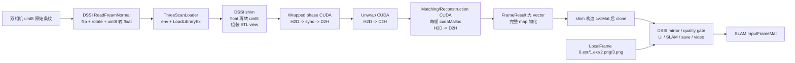
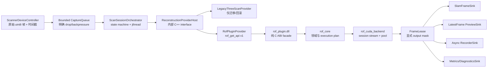

# reconstructOneFrame 与 DSSI 跨仓库架构评估及重构方案

> 日期：2026-07-13
> 上游审计基线：`D:\code\reconstructOneFrame`，`main@1accb19`
> 下游审计基线：`D:\code\_worktrees\dssi-adapt-res1f`，`adapt-res1f@bc0ad329`
> 文档性质：架构审计与目标设计；第 17 节追加 2026-07-13 实施复核和真实数据验收结果
> 约束：保留 DLL 热加载能力；Legacy `threeScan_*` 只允许作为迁移桥，不作为长期 ABI

## 1. 结论先行

`reconstructOneFrame` 已经完成了从 Legacy 巨型算法类向目录化模块、显式状态码、CUDA 实现和可验证 sample 的重要跃迁，但当前工程还不能称为成熟的现代 C++ 插件架构。

核心问题不是“C++17 不够新”，而是运行时边界仍受 Legacy 契约支配：

- 核心算法、OpenCV、CUDA 部署和 DSSI 兼容 shim 被编译进同一个 DLL。
- 对外热加载接口虽然是 `extern "C"` 符号，参数却仍跨 DLL 传递 `cv::Mat`、`std::string` 和 `std::vector`。
- GPU 阶段通过 host vector 串联，形成多次 D2H/H2D 和同步；point-cloud 阶段仍逐帧分配大量 device buffer。
- DSSI 把设备采集、图像预处理、算法、UI、SLAM、质量门禁、录像和落盘塞在同一个 detach worker 中。
- 配置、坐标、生命周期、错误传播和部署都没有形成可独立验证的跨仓库协议。

因此，不建议围绕当前 `threeScan_*` 继续堆补丁。推荐目标是：

1. 在 DSSI 内建立窄而稳定的 `IScanReconstructionProvider` 反腐层。
2. 用一个带版本协商的纯 C ABI 取代 `threeScan_*`，ABI 中只出现固定宽度 POD、opaque handle、pointer+count 和显式容量。
3. 把 Res1F 改为 session-owned execution plan：配置、标定、CUDA stream、memory pool、预处理 map 和 workspace 都归属于 session。
4. 让条纹、相位、unwrap、匹配、重建保持 device-resident，只在输入和被请求的最终输出处传输。
5. 把 DSSI 实时链改为可停止、可 join、有界队列驱动的 stage pipeline；Raw Replay 必须走同一 provider。
6. 用 runtime manifest 绑定插件、算法配置、标定、依赖和版本，不再从开发机 build 目录运行。

这是一条“架构上掀桌子、迁移上可回滚”的路线。当前 shim 可以继续存在一段时间，但其唯一使命应是兼容和对照。

## 2. 审计范围与事实口径

本次结论来自当前代码，不把历史设计愿望当作已实现事实。

### 2.1 Res1F 主要证据

- C++/CUDA 标准与单 DLL target：`CMakeLists.txt:3-28`。
- OpenCV/CUDA 依赖、全符号导出和 post-build DLL copy：`CMakeLists.txt:48-109`。
- 公共 C++ 类型与 C ABI 注释占位：`include/reconstruct_one_frame/reconstructInterface.h:23-209`。
- engine 生命周期：`src/pipeline/ReconstructEngine.cpp:11-76`。
- pipeline 与输出物化：`src/pipeline/SingleFramePipeline.cpp:40-294`。
- Legacy/DSSI shim：`src/dssi/DssiThreeScanCompat.cpp:35-470`。
- host 中间结果：`src/phase/WrappedPhaseComputer.h:10-41`、`src/phase/PhaseUnwrapper.h:9-34`。
- point-cloud 大结果对象：`src/reconstruction/PointCloudReconstructor.h:13-67`。
- CUDA 阶段同步和传输：`src/phase/WrappedPhaseComputerCuda.cu:187-281`、`src/phase/PhaseUnwrapperCuda.cu:241-360`。
- point-cloud 逐帧分配：`src/reconstruction/PointCloudReconstructorCuda.cu:1059-1202`。
- 全局日志 sink：`src/logging/LogSession.cpp:12-16`、`102-168`。

### 2.2 DSSI 主要证据

- 动态 loader 与旧函数签名：`ServiceInterface/src/threeScan.hpp:21-112`、`128-225`。
- provider 配置和开发机绝对路径：`ServiceInterface/src/ScanService.cpp:218-320`。
- loader 初始化未检查算法 ready：`ServiceInterface/src/ScanService.cpp:902-955`。
- detach 保存线程：`ServiceInterface/src/ScanService.cpp:957-1008`。
- 实时采集/算法/SLAM/UI 混合链：`ServiceInterface/src/ScanService.cpp:1225-1585`。
- 显示镜像影响物理遮挡 mask：`ServiceInterface/src/ScanService.cpp:651-677`。
- LocalFrame 绕过算法：`ServiceInterface/src/ScanServiceIo.cpp:447-580`。
- `uint8 -> float` 兼容转换：`ServiceInterface/src/ScanServiceIo.cpp:599-624`。
- SLAM 启动失败无法阻断扫描：`ServiceInterface/src/ScanService.cpp:1796-1835`、`1158-1215`。
- DSSI 当前 CTest 数量为 0。

### 2.3 特意排除的误判

DSSI 的渲染和健康检查代码显式处理 4x4 `Q`，所以 shim 返回 `Q` 不能只凭“不是 3x3 K”定性为错误。真正需要修复的是 camera model 契约不显式，而不是贸然把矩阵改回 3x3。

## 3. 当前真实数据流



这条链的主要浪费和风险点很直观：

- 同一批像素先 `uint8 -> float`，进入 shim 后再 `float -> uint8`。
- 每个 CUDA 大阶段都把完整中间结果拉回 host，下一阶段再上传。
- 算法输出先进入 STL vector，随后又 clone 成 OpenCV-owned buffer。
- LocalFrame 只验证解码后消费路径，不验证算法插件。
- 算法耗时、UI clone、SLAM 调用、日志和失败落盘共享同一 worker 的延迟预算。

## 4. 做对了什么

本项目不是“全部推倒重来”。以下资产值得保留：

- `ReconstructEngine` 使用 PIMPL，内部实现仍有演进空间。
- 内部 `StatusCode + module + message` 比 Legacy 的 `bool/0/-1` 更可诊断。
- 输入已经抽象为带 stride/type 的 `ImageView`，核心 API 没有直接依赖 `cv::Mat`。
- phase、unwrap、reconstruction、quality、calibration 已形成可定位的源码目录和测试入口。
- 多频不同相移步数已由 `stripeRequirements` 显式表达，不再被全局 STEP 完全绑死。
- count-only、按需颜色、质量开关等优化表明团队已经在区分生产热路径与诊断物化。
- DSSI loader 使用 `unique_ptr`、`LoadLibraryEx` 和 `AddDllDirectory`，比 raw pointer 和全局 `SetDllDirectory` 更合理。
- 当前真实数据已有可复现基线：Upper `0..465` 为 `Ok=442`、`ReconstructionInsufficient=24`，总点数 `36,546,920`；这可以成为重构回归门禁。

问题在于这些局部改进尚未组成稳定的跨仓库体系。

## 5. 架构评分

| 维度 | 评分 | 结论 |
|---|---:|---|
| 算法源码模块化 | 6/10 | 目录边界已有雏形，但 pipeline 和 1561 行 CUDA 文件仍聚合过多职责 |
| 现代 C++ 所有权 | 5/10 | core 使用 RAII/PIMPL；DSSI 仍大量 detach、共享普通 bool 和隐式生命周期 |
| 对外 ABI | 2/10 | STL/OpenCV 跨 DLL，C ABI 只有名字是 C，缺版本和容量契约 |
| 错误与状态传播 | 4/10 | core 状态较强；shim 压成 `-1`，init 是 void，DSSI 不做 ready 门禁 |
| GPU 执行架构 | 4/10 | kernel 已 CUDA 化且已有优化，但不是 device-resident pipeline，分配/同步边界不理想 |
| 配置与部署 | 2/10 | build tree、环境变量、绝对路径、重复 ini 和多 JSON 无 manifest 绑定 |
| 坐标与数据语义 | 4/10 | 部分镜像语义已修正，但 sensor、algorithm、SLAM、display 仍靠分散 flag 协作 |
| 下游可测试性 | 2/10 | DSSI 0 项 CTest，LocalFrame 绕过算法，没有跨仓库 contract/e2e test |
| 可观测性 | 5/10 | 有 stage stats 和 summary，但 core 全局 logger、DSSI 每帧 info 和同步失败落盘不合理 |
| 综合成熟度 | 4/10 | 可运行的迁移版本，不应冻结为长期平台契约 |

## 6. 主要问题与风险等级

### 6.1 阻断级：`threeScan_*` 不是稳定 ABI

`extern "C"` 只固定符号名，不会固定 C++ 对象布局和 allocator/CRT 行为。当前 ABI 暴露：

- `cv::Mat*`
- `std::string*`
- `std::vector<std::string>*`
- C++ class pointer

它要求两侧在编译器、运行库、OpenCV 版本、Debug/Release allocator 和异常模型上保持隐式一致。任何一侧独立升级都可能从“能编译”变成运行时内存破坏。

当前公共头虽然写了未来 stable C ABI 的注释，但没有真实结构、导出和版本协商。这意味着迁移层已经进生产，替代层仍不存在。

### 6.2 阻断级：初始化失败没有闭环

Res1F `threeScan_init` 保留 `void`。config 解析失败时会把 `imageCount` 设为 0；calibration 或 engine 初始化失败发生在 capture count 已计算之后，`imageCount` 可能仍是看似有效的非零值。失败只稳定地反映在 version 和内部 last error，而 DSSI 调用后无条件：

- 保存 camera matrix；
- 记录 loader success；
- 后续用 `_scanImgNum` 配置投影和 buffer；
- 允许启动扫描。

这会把“DLL 被加载”误当成“算法已 ready”。启动流程必须是事务：任何 provider/config/calibration/SLAM/device step 失败都要阻断并逆序回滚。

### 6.3 阻断级：异常可能跨 ABI，线程可能越过对象生命周期

Res1F 导出函数没有 catch-all exception firewall。`new`、vector/string 分配和 OpenCV 异常都可能穿过 DLL 边界。

DSSI 保存线程、采集线程、LocalFrame 线程和 camera thread 使用 detach 并捕获 `this`。停止主要依赖普通 bool 和 sleep，没有 join 保证。`ScanService` 析构时无法证明所有 worker 已停止访问成员。

这不是风格问题，而是潜在 terminate、use-after-free 和数据竞争问题。

### 6.4 高风险：backend 开关与真实加载对象可以不一致

`algorithmBackend`、`algorithmDll`、`algorithmConfig` 和 `algorithmCalib` 是四个松散字段。当前 ini 显式写死 Res1F 路径，因此只把 backend 改成 legacy 不会自动清掉这些显式值。

结果可能是日志显示 legacy，但实际仍加载 Res1F。provider 应由一个不可分割的 manifest entry 表达，选择 backend 就选择完整 bundle。

### 6.5 高风险：核心库和下游兼容层物理耦合

一个 `reconstructOneFrame` target 同时包含 core、OpenCV shim 和 DSSI legacy ABI，并开启 `WINDOWS_EXPORT_ALL_SYMBOLS`。后果是：

- core 无法在不引入 OpenCV ABI 的情况下独立发布。
- DSSI 适配细节可以反向污染公共 API 和输出物化策略。
- DLL 导出面由 linker 推断，无法审计稳定 surface。
- sample、tests、plugin 和 compat adapter 无法分别设置依赖与 sanitizer 策略。

### 6.6 高风险：GPU 阶段是“CUDA 函数串联”，不是 GPU execution graph

当前中间类型以 host vector 表达：

- wrapped phase D2H；
- unwrap 把 wrapped phase H2D，完成后再 D2H；
- reconstruction 把 absolute phase 再 H2D；
- point-cloud 每帧重新分配多组 device buffer。

这会增加延迟抖动和 CPU 物化成本，也阻止 stream overlap、CUDA Graph 和统一 memory pool。现有无输出 benchmark 已经很快，所以这不是“当前一定不够快”的断言，而是完整 DSSI 路径和未来扩展的确定结构上限。

### 6.7 高风险：控制面、数据面和诊断面混在结果对象中

`FrameResult` 同时承载：

- status 和 stage stats；
- 多个可变长 summary string；
- depth/normal/color/quality 四张完整图；
- PLY 路径和 Legacy 对比文本。

插件调用只需要固定类型输出和少量 metrics，却被迫依赖一个动态分配密集的工具型对象。输出请求也只有 `materializeFrameOutputs` 大开关，无法表达“SLAM 只要 depth/normal/color，不要 quality/vertices/strings”。

### 6.8 高风险：坐标域没有成为类型或契约

当前至少有四个坐标域：

1. 原始 sensor 像素。
2. flip/rotate 后的标定输入像素。
3. Res1F 左相机三维坐标和 SLAM 输入。
4. UI/导出显示坐标。

它们目前靠 `inputMirrorAxis`、`localFrameInputMirror`、`scanHeadDisplayMirror` 等 flag 协作。更不合理的是物理结构遮挡 mask 是否启用、裁剪边如何映射，依赖 display mirror。

显示设置不应改变算法输入。物理 mask 必须定义在 sensor/calibration domain；display mirror 只能出现在 presentation/export adapter。

### 6.9 高风险：DSSI 的 ScanService 是事实上的 God object

当前相关文件规模：

- `ScanService.cpp`：4342 行。
- `ScanService.h`：807 行。
- `ScanServiceIo.cpp`：3596 行。
- `ScanServiceRender.cpp`：3930 行。

一个服务对象同时拥有设备、算法 loader、SLAM、VTK、UI signal、文件 I/O、录像、质量、坐标、TSDF 和线程。即使 Res1F 自身重构干净，下游仍会把它重新耦合成不可验证的调用链。

### 6.10 中风险：配置和日志仍是全局/隐式状态

- DSSI 用进程级环境变量把 config/calibration 传给插件，多实例会相互污染。
- Res1F shim 和 engine 重复解析同一份配置/标定。
- `ReconsConfig` 混合采集、算法、AI、诊断和输出领域。
- core logger 使用未同步的全局裸指针；DSSI 插件场景没有激活 session 时日志静默丢失。
- DSSI 同时存在 `ss_config.ini`、`res/ss_config.ini`、`reconsAlgPara.json`、`algPara.json` 和标定文件，缺少 schema/version/hash 关系。

### 6.11 中风险：回放和测试给出虚假的安全感

LocalFrame 是 decoded replay，不是 raw replay。它适合验证 SLAM，但不能证明：

- DLL 加载和 ABI；
- capture plan；
- 条纹预处理；
- Res1F 输出；
- init/shutdown；
- 坐标从 raw sensor 到 SLAM 的完整链。

应把两种回放明确命名为 `RawCaptureReplay` 和 `DecodedFrameReplay`，并分别设置验收目标。

## 7. 三条重构路线比较

| 路线 | 内容 | 优点 | 缺点 | 结论 |
|---|---|---|---|---|
| A. 继续修补 threeScan | 在旧签名上补 initEx、更多 lastError、更多配置字段 | 改动小、回滚容易 | ABI、OpenCV/STL、数据拷贝和 provider 假切换都无法根治 | 只用于短期止血 |
| B. Provider 反腐层 + 版本化 C ABI | DSSI 内部 provider 接口，插件仅暴露 POD C ABI，Res1F session 化 | 解决主要结构问题，保留 DLL 热切换，可渐进迁移 | 两仓库都要改，需要 contract tests | 推荐路线 |
| C. 进程外 reconstruction worker | DSSI 通过 shared memory/IPC 调用独立 GPU worker | 崩溃隔离、独立升级、可监控 | IPC、部署、GPU buffer 共享和调试复杂度高 | 有隔离硬需求后再评估 |

路线 B 不是保守方案。它会废除当前长期 ABI、重划两仓库职责，并重写实时 orchestration，但可以用 Legacy provider 和 current shim 保持可回滚。

## 8. 推荐目标架构



### 8.1 Res1F target 划分

```text
rof_contract             # INTERFACE，纯 C 头、ABI 版本、POD 类型
rof_domain               # 强类型 frame/config/status，纯 C++20，无 OpenCV
rof_core                 # execution plan 和算法编排
rof_cuda_backend         # CUDA stream、memory pool、kernel、device views
rof_diagnostics          # metrics/event，不做同步文件 I/O
rof_io                    # sample/离线 PLY/EXR/PNG，不链接进生产热路径
rof_plugin               # 唯一稳定 DLL，显式导出 rof_get_api
rof_three_scan_compat    # 可选迁移 DLL，旧 ABI，独立于 core 公共接口
rof_sample
rof_tests
```

关键规则：

- 禁用 `WINDOWS_EXPORT_ALL_SYMBOLS`，使用显式 `__declspec(dllexport)` 或 `.def` 文件。
- `rof_plugin` 只导出一个入口 `rof_get_api`，其余函数通过版本化 function table 提供。
- OpenCV 只能存在于 compat/host adapter，不进入 stable ABI 和 domain types。
- PLY、Legacy compare、debug map 不进入生产 plugin target。

### 8.2 DSSI 组件拆分

不建议一次重写全部 ScanService。采用 strangler extraction，优先切出实时链：

| 组件 | 单一职责 |
|---|---|
| `ScannerDeviceController` | 设备开关、投影计划、原始帧获取 |
| `ScanSessionOrchestrator` | 生命周期状态机、worker、队列、启动回滚 |
| `IReconstructionProvider` | DSSI 内部稳定 C++ 抽象，不跨 DLL |
| `RofPluginProvider` | C ABI 加载、版本协商、buffer 适配 |
| `LegacyThreeScanProvider` | 旧 DLL 适配和 A/B 回滚 |
| `CoordinateContract` | sensor/calibration/SLAM/display 显式变换 |
| `SlamFrameSink` | 校验后调用 `InputFrameMat` |
| `PreviewSink` | latest-value UI，允许丢帧 |
| `RecordingSink` | 有界异步录像/SourceImg/decoded output |
| `RawCaptureReplaySource` | 从 SourceImg 走完整 provider 链 |
| `DecodedFrameReplaySource` | 从 EXR/PNG 只测 SLAM 消费链 |

这不是为了制造类，而是为了让每个线程和数据 owner 都能回答：谁创建、谁停止、谁等待、谁释放、队列满时怎么办。

## 9. 稳定 ABI 设计

### 9.1 唯一入口和版本协商

示意接口：

```c
typedef struct RofApiV1 RofApiV1;

ROF_EXPORT int32_t rof_get_api(
    uint32_t requested_abi_major,
    uint32_t requested_abi_minor,
    uint32_t host_table_size,
    RofApiV1* out_api);
```

`RofApiV1` 包含 `create_session/configure/get_capture_plan/process/drain/destroy_session` 等函数指针，以及：

- `struct_size`
- `abi_major/abi_minor`
- `plugin_build_id`
- `capability_bits`

major 不兼容时 fail closed；minor 通过 `struct_size` 尾部扩展。DSSI 只 `GetProcAddress("rof_get_api")` 一次。

### 9.2 ABI 中允许的类型

只允许：

- `uint32_t/int32_t/uint64_t/size_t`
- 固定布局 enum，显式 underlying value
- `void*` opaque session
- `const void* + byte_size`
- POD struct + `struct_size`
- caller-owned output buffer 或显式 release callback

禁止：

- STL 容器和字符串
- `cv::Mat`
- C++ class/vtable
- 跨边界 new/delete
- 异常

### 9.3 输入和输出描述符

```c
typedef struct RofImageViewV1 {
    uint32_t struct_size;
    const void* data;
    size_t byte_size;
    uint32_t width;
    uint32_t height;
    uint32_t stride_bytes;
    uint32_t channels;
    uint32_t element_type;
    uint32_t memory_kind;
    uint32_t coordinate_space;
} RofImageViewV1;

typedef struct RofOutputBufferV1 {
    void* data;
    size_t capacity_bytes;
    size_t written_bytes;
    uint32_t stride_bytes;
} RofOutputBufferV1;
```

`process` 必须接收：

- frame id、capture timestamp、stripe descriptor 数组；
- output request bitmask；
- 每个输出的容量和 stride；
- cancellation/deadline token 的宿主表达。

它必须返回：

- 稳定 status code、severity、retriable flag；
- 实际写入尺寸和 bytes；
- 固定尺寸 frame metrics；
- 不返回指向插件内部 `std::string::c_str()` 的裸指针。

### 9.4 capture plan 与 camera model

插件初始化成功后返回显式 `CapturePlan`：

- 需要的 projector index 列表；
- 每个频率的 phase steps；
- color/auxiliary frames；
- 输入尺寸、方向、element type；
- 最大 in-flight frame 数。

DSSI 只能依据这个 plan 配置设备，不能自己猜 `_scanImgNum`。

camera model 同时携带明确类型和语义：

- `model_type = Intrinsics3x3 | ReprojectionQ4x4`
- image size
- unit
- output coordinate frame
- K/Q 数组和版本

## 10. Res1F 内部现代 C++ 设计

### 10.1 语言标准

建议 host C++ 基线升级到 C++20，CUDA 侧按当前 nvcc/MSVC 组合验证后同步。优先使用：

- `std::span` 表达非 owning 连续视图；
- `std::jthread` 和 `std::stop_token` 管理 worker；
- `enum class : uint32_t` 固定协议枚举；
- `std::chrono` 强类型 duration/deadline；
- `std::pmr` 只用于经 profile 证明的 host frame arena；
- concepts 只约束内部 image/device view 模板，不用于 ABI。

如果当前工具链完整支持 C++23，可在内部使用 `std::expected<T, Error>`；否则保留项目自己的 `Result<T>`。不要让“先进 C++”变成语法展示。

### 10.2 所有权与生命周期

建议核心对象：

```cpp
class ReconstructionSession final {
public:
    static Result<std::unique_ptr<ReconstructionSession>> create(SessionDescriptor);
    Result<FrameLease> process(const FrameInput&, OutputMask, Deadline);
    Result<void> drain();

private:
    ImmutableExecutionPlan plan_;
    CudaStream stream_;
    CudaMemoryPool pool_;
    FrameWorkspace workspace_;
    DiagnosticsSink& diagnostics_;
};
```

规则：

- config/calibration 只解析一次，编译为 immutable execution plan。
- CUDA stream、event、buffer 和 map 都归 session，不用函数级 `thread_local` 隐藏 owner。
- v1 明确“同一 session 串行 process”；需要并行时创建多个 session。
- shutdown/drain 幂等，并等待 in-flight work。
- ABI facade 捕获所有异常，映射为稳定 `InternalError`，绝不越界。

### 10.3 Device-resident frame graph

目标热路径：

```text
raw uint8 host/pinned
  -> 单次 H2D
  -> orientation/remap
  -> wrapped phase
  -> unwrap
  -> matching
  -> reconstruction/filter/normal/color/quality
  -> 仅按 OutputMask D2H
```

中间结果应是 `DeviceImageView<T>` / `DeviceFrameArena`，不再是 host vector。初始化完成后：

- steady-state `cudaMalloc` 次数为 0；
- stage 间完整图 D2H 次数为 0；
- 用 CUDA event 计时，不为计时强制 `cudaDeviceSynchronize()`；
- 可在稳定后评估 `cudaMallocAsync` memory pool 和 CUDA Graph；
- debug materialization 走旁路，默认关闭并有独立预算。

### 10.4 输出按需与 lease

把当前 `FrameResult` 拆为：

- `FrameStatus`：固定小对象；
- `FrameMetrics`：固定 POD 统计；
- `FrameLease`：指向预分配 depth/normal/color/quality buffers；
- `OfflineArtifacts`：仅 sample/tool 使用的 PLY/path/string。

DSSI 默认 request 应明确为 `Depth | Normal | Color | Quality`。benchmark 可只请求 `PointCount | Metrics`。没有被请求的输出不得计算、D2H 或分配。

## 11. DSSI 实时编排重构

### 11.1 状态机

```text
Stopped
  -> LoadingProvider
  -> ConfiguringProvider
  -> ConfiguringSlam
  -> ConfiguringDevice
  -> Ready
  -> Running
  -> Draining
  -> Stopped
```

任何一步失败都返回结构化状态并逆序释放已完成步骤。只有 `Ready` 才允许打开 projector。

### 11.2 worker 和队列

建议最少三个可 join worker：

1. `CaptureWorker`：只收设备帧和 timestamp，写入有界队列。
2. `ReconstructionWorker`：串行调用 provider，写入 frame lease/metrics。
3. `RecorderWorker`：按策略异步保存 SourceImg/decoded output。

UI 使用 latest-value slot，不应阻塞算法；SLAM sink 的队列和超时必须显式。所有 worker 使用 `std::jthread`，服务析构时 stop、close queues、join，再卸载 plugin。

队列满策略必须配置并计数，例如：

- 扫描生产：阻塞很短 deadline 后 drop oldest raw frame；
- 质量诊断：停止采集并报告 overload；
- Local raw replay：不丢帧，按离线速度运行。

### 11.3 坐标契约

固定并文档化四个空间：

| 空间 | Owner | 允许的变换 |
|---|---|---|
| `SensorRaw` | device/capture | 物理结构 mask、原始方向 metadata |
| `CalibrationInput` | Res1F preprocess | 与标定一致的 flip/rotate/remap |
| `LeftCameraMetricMm` | Res1F output / SLAM input | XYZ、normal、valid mask |
| `Display` | DSSI presentation | UI mirror、export presentation transform |

必须删除“display mirror 决定 sensor mask”的依赖。显示镜像不能改写送入 SLAM 的几何，除非一个显式、版本化的 coordinate adapter 说明这么做。

### 11.4 两类 replay

- `RawCaptureReplay`：读取 SourceImg/raw capture，经过同一 provider、同一 output validator、同一 SLAM sink。这是算法集成验收入口。
- `DecodedFrameReplay`：读取 EXR/PNG，跳过 provider，只验证 SLAM/显示/融合。保留现有 LocalFrame，但更名并明确口径。

## 12. 配置与部署

### 12.1 Runtime manifest

建议一个 session bundle：

```json
{
  "schemaVersion": 1,
  "provider": {
    "id": "res1f",
    "plugin": "plugins/res1f/reconstructOneFrame.dll",
    "abiMajor": 1,
    "abiMinor": 0
  },
  "algorithm": {
    "config": "config/reconsAlgPara.json",
    "sha256File": "config/reconsAlgPara.json.sha256"
  },
  "calibration": {
    "result": "calibration/calibResult.json",
    "sha256File": "calibration/calibResult.json.sha256"
  },
  "runtime": {
    "dependencyManifest": "plugins/res1f/dependencies.json"
  }
}
```

路径相对 manifest 解析。不要再：

- 写死 `D:/code` 下的开发机绝对路径；
- 用环境变量传每个 session 的算法参数；
- 从另一个仓库的 build tree 直接运行；
- 只修改 backend 字符串却保留旧 provider 的显式路径。

### 12.2 CMake 与打包

- 使用 `install(TARGETS rof_plugin RUNTIME DESTINATION plugins/res1f)` 等显式规则安装 plugin、import lib、contract header 和 runtime dependencies。
- 使用 CMake package/CPack 或项目现有部署脚本生成原子目录。
- Debug/Release 依赖严格分开。
- package 内记录 build id、git commit、compiler、CRT、CUDA runtime、OpenCV compat adapter 版本。
- loader 只给 package plugin directory 增加 DLL search path；CUDA 依赖按官方 redistributable/driver 要求部署，不依赖开发机 `CUDA_PATH`。

## 13. 分阶段迁移方案

### Phase 0：给当前桥接层加护栏

目标：不改变算法结果，先消除最危险失败模式。

- DSSI 检查 init ready、image count、camera model 和 last error；失败禁止启动 projector。
- Res1F 所有导出函数增加 exception firewall。
- backend + DLL/config/calib 改为原子 provider descriptor，未知 backend fail closed。
- 增加 current `threeScan_*` DLL load/init/run/destroy contract smoke。
- 停止把 DSSI build tree 和 Res1F build tree当部署目录。

退出条件：缺 DLL、缺 config、坏 calibration、缺符号、init failure 都能稳定返回且不启动扫描。

### Phase 1：建立新 ABI 和 DSSI Provider Host

- 新增 `rof_contract` 和 `rof_plugin`，实现 `rof_get_api v1`。
- DSSI 抽出 `IReconstructionProvider`、`RofPluginProvider`、`LegacyThreeScanProvider`。
- 新 ABI 先保留当前 host buffer 数据流，确保功能等价。
- current shim 保留用于 A/B 和紧急回滚。

退出条件：DSSI 可由 manifest 在两 provider 间切换，实际加载对象、日志 build id 和配置 hash 一致。

### Phase 2：统一采集、坐标和 replay 契约

- provider 返回 `CapturePlan`，DSSI 不再维护隐式 `_scanImgNum`。
- raw input 改为 `uint8` descriptor，去掉 `uint8 -> float -> uint8`。
- sensor mask、calibration transform、SLAM coordinate、display transform 分层。
- 新增 RawCaptureReplay；旧 LocalFrame 明确为 DecodedFrameReplay。

退出条件：live 与 raw replay 在同一 SourceImg 上得到同类型、同尺寸、同坐标输出。

### Phase 3：GPU session execution plan

- 把 config/calibration/map/device buffers 编译进 session。
- wrapped/unwrap/matching/reconstruction 使用 device views 直连。
- point-cloud buffer 改为 session pool，steady-state 无 `cudaMalloc`。
- 输出按 mask D2H，metrics 用 event/小统计 buffer 回传。

退出条件：warmup 后每帧 device allocation 为 0，阶段间完整图 D2H 为 0，算法数值回归通过。

### Phase 4：重构 DSSI 实时生命周期

- detach worker 替换为 `std::jthread`。
- capture/reconstruction/recording 拆成有界队列。
- Start/Stop 变为显式状态机和逆序回滚。
- UI/日志/落盘从 reconstruction deadline 中移出。

退出条件：连续 start/stop、切颌、provider init failure、队列过载都无 orphan thread、无死锁、无扫描误启动。

### Phase 5：删除 Legacy ABI

只有在新 provider 完成真实下游验收、现场回滚窗口结束后：

- 从 core DLL 移除 `threeScan_*`。
- 删除 DSSI `ThreeScanLoader`。
- compat target 转为离线归档或完全删除。
- 冻结并发布 ABI v1 compatibility policy。

## 14. 验证与验收门禁

### 14.1 ABI 与失败隔离

- `rof_abi_layout_test`：固定 struct size/alignment/enum value。
- `rof_plugin_loader_test`：正常、缺 DLL、缺依赖、ABI major 不匹配、缺符号。
- load/create/init/destroy/unload 循环至少 100 次。
- 插件内部故意抛异常，宿主只收到 `InternalError`，进程不崩溃。
- output buffer 使用 canary，验证容量不足时不越界写。

### 14.2 算法回归

- Upper `0..465` 保持 `Ok=442`、`ReconstructionInsufficient=24`。
- 总点数基线 `36,546,920`；迁移阶段要求逐帧点数一致或每个差异都有批准的算法变更说明。
- frame 100 保持当前几何/颜色/法向基线。
- depth=`float32x3`、normal=`float32x3`、color=`uint8x3`、quality=`uint16x3`。
- 无效点表达、单位 mm、左相机坐标和 normal 方向必须写入 contract test。

### 14.3 性能

- 先测当前 DSSI 完整物化路径 p50/p90/p99，不能用 count-only 代替。
- 每个迁移 phase 的 p90 不得无说明回退超过 5%。
- 25 FPS 场景最终 reconstruction p99 目标不高于 30 ms，capture 到 SLAM 入队的端到端 p99 不高于 40 ms。
- warmup 后 `cudaMalloc/cudaFree=0`。
- stage 间完整图 D2H/H2D=0。
- reconstruction worker 内同步文件 I/O=0，逐帧 info 默认关闭或采样。

### 14.4 生命周期与下游

- Start/Stop 100 次，进程 thread/handle/GPU memory 回到稳定基线。
- provider init 失败时 projector 不开启，SLAM 不启动。
- RawCaptureReplay 和 live capture 对同一原始帧输出一致。
- DecodedFrameReplay 明确只用于 SLAM，不得出现在算法验收报告里。
- 用 DentalScanSystem 真实扫描验证 SLAM tracking、世界位姿、融合点云和最终 Upper 输出，不只验证 DLL 能加载。

### 14.5 工具

- host C++ target：`/W4 /permissive-`、clang-tidy、MSVC ASan 可覆盖部分。
- DLL/线程生命周期：Application Verifier、重复加载、故障注入。
- CUDA：compute-sanitizer、event timing、allocation/transfer counters。
- 跨仓库 contract tests 应进入 CI 或至少进入统一的 Release 验证脚本。

## 15. 明确不建议做的事

- 不要把当前 `threeScan_*` 改名为 `rof_*` 后宣布 ABI 稳定。
- 不要在稳定 ABI 中暴露 `cv::Mat`、STL 或 C++ class。
- 不要只升级到 C++23、加 concepts/coroutine，就称架构先进。
- 不要继续用环境变量给每个实例传算法配置。
- 不要让 UI mirror、export mirror 或 LocalFrame flag 改变 sensor mask 和算法几何。
- 不要为了“零拷贝”把裸 CUDA pointer 无生命周期地暴露给 DSSI。
- 不要先上进程外微服务；先把进程内 contract、owner 和 state machine 做正确。
- 不要用 DSSI LocalFrame 通过替代 Raw Replay 和 live scan 证据。
- 不要在算法线程同步保存失败帧、写 PLY 或刷逐帧 info。
- 不要在新 provider 稳定前删除 Legacy 回滚路径。

## 16. 建议评审决策

建议本次评审只确认以下五个架构决定：

1. `threeScan_*` 明确降级为临时兼容 ABI，不再扩展为长期接口。
2. DSSI 引入 provider 反腐层，并保留 Legacy/Res1F 双 provider 回滚。
3. 新稳定边界采用版本化纯 C function table，不跨 DLL 传 C++/OpenCV 对象。
4. Res1F 采用 session-owned device-resident execution plan，DSSI 采用可 join 的有界流水线。
5. 配置和部署采用原子 manifest bundle，坐标域和两类 replay 写入正式 contract。

这五项确认后，再分别为 Phase 0 和 Phase 1 写可执行实施计划。不要把 ABI、GPU residency 和 DSSI 线程重构塞进一个无法审查的大提交。

## 17. 2026-07-13 实施复核

本节对照第 13、14 节复核实际代码和验证结果。详细性能数据见
[07131555 Res1F 与 Legacy 性能大比拼](../benchmarks/2026-07-13-07131555-res1f-vs-legacy-benchmark.md)。

### 17.1 Phase 实施状态

| Phase | 状态 | 已落地 | 尚未完成或不应提前完成 |
|---|---|---|---|
| 0 | 基本完成 | Provider ready gate、未知 backend fail-closed、SLAM 启动失败阻断、全部兼容导出 exception firewall | build tree 仍参与本机运行，尚无发布级 runtime manifest |
| 1 | 基本完成 | `rof_get_api` ABI 1.2、opaque session、caller-owned output、frame flags、`IReconstructionProvider`、Res1F/Legacy provider、回滚 shim、DSSI contract test | DLL/config/calibration/build id/hash 尚未绑定为原子 manifest |
| 2 | 基本完成 | CapturePlan 包含尺寸/相移/投影/辅助帧，热路径改为 `uint8` batch，坐标域显式化，sensor mask 与 display mirror 解耦，新增 RawCaptureReplay；metal capability 已协商和消费，AI 未实现时 fail closed | live capture 与 raw replay 的逐像素一致性仍需真实设备验收 |
| 3 | 部分完成 | wrapped/unwrap/point-cloud workspace 改为 pipeline/session ownership，point-cloud device buffer 按容量复用 | wrapped -> unwrap -> reconstruction 仍以 host vector 交接，完整图 D2H/H2D 尚未消除 |
| 4 | 部分完成 | capture/save/camera/local replay/cleanup/connect 等实时关键 worker 改为 `std::jthread`，关键扫描 flag 改为 atomic | 尚未形成 capture/reconstruction/recording 有界队列和完整状态机；非实时网格/咬合任务仍有 detach |
| 5 | 明确延期 | Legacy provider 和 `threeScan_*` shim 保留用于本轮 A/B 与回滚 | 必须等真实 DentalScanSystem 下游验收和现场回滚窗口结束后才能删除 |

这里的“基本完成”不是“所有门禁通过”。它表示目标边界已经建立，旧 ABI 和 God object 不再是 Res1F 的唯一集成方式；尚未完成项仍按验收结果保留，不能通过改文档状态掩盖。

### 17.2 新增契约和生命周期证据

- Res1F DLL 只显式导出 `rof_get_api` 和 8 个迁移期 `threeScan_*`，不再自动导出全部 C++ 实现符号。
- ABI 1.1 CapturePlan 首选 `uint8`、声明 `CalibrationInput` 坐标域和 `max_in_flight_frames=1`，并兼容 ABI 1.0 前缀。
- 新增 x64 ABI layout test，固定公开结构体大小、关键 offset 和常量值。
- DLL 动态测试完成 100 次 `LoadLibrary -> rof_get_api -> create_session -> destroy_session -> FreeLibrary`，同时覆盖缺 DLL、缺符号和 ABI major mismatch。
- bounded error copy 使用前后 canary 验证未越界；真实 frame output canary 和插件故意抛异常仍需要专用 fault-injection test target。
- DSSI Provider host 使用 C++20、`/W4 /permissive-`，OpenCV 头按 SYSTEM 引入；新鲜构建未再出现 OpenCV 4.5.3 `C5054`。

### 17.3 CUDA 和性能门禁

连续运行 frame 0、1、2 时，point-cloud `deviceAllocationCount` 为 `13,0,0`，证明该阶段 warmup 后不再逐帧 `cudaMalloc`。这只满足“point-cloud steady-state allocation 为 0”，不等于整个 frame graph 已 device-resident：frame 1 仍记录 `hostToDeviceMs=0.1395`，wrapped/unwrap 接口也仍返回 host vector。

指定 `0..294` 完整物化 provider 路径中，缓存预热后的结果为：

- Res1F process p50/p90/p99：`28.7615/31.2779/35.1074 ms`；
- Legacy process p50/p90/p99：`24.4501/27.9776/32.6854 ms`；
- Res1F wall throughput：`26.874 FPS`，Legacy：`30.050 FPS`。

因此当前 Res1F 未通过本文件设定的 `p99 <= 30 ms` 门禁。Res1F engine 内部耗时到 Provider 完整输出之间还存在约 `2.86 ms` 平均、`4.41 ms` p99 的 adapter/copy 开销。后续优化应优先围绕 caller-owned output 直写和 device-resident stage graph，而不是继续优化已低于 1 ms 的 point-cloud kernel。

### 17.4 算法与功能门禁

本轮指定数据两边均为 `295/295` 调用成功，但“成功”不能解释为结果等价：

- Res1F 总有效点 `17,438,437`；
- Legacy metal 总有效点 `34,823,883`，Res1F/Legacy=`0.500761`；
- Legacy non-metal 控制组总有效点 `27,662,610`，Res1F/Legacy=`0.630397`；
- frame 197 的 Res1F 仅 `10` 点却仍返回 `Ok`，说明零点才失败的状态阈值过宽。

该轮测试发生在 ABI 1.2 mode capability 实施之前：当时 Res1F 接受但忽略 metal mode。因此这里的 `0.500761` 只保留为历史基线，不能代替后续 07131838 的 mode-aware 结果。

### 17.5 仍必须保留的后续项

以下工作仍有必要，但不适合在没有独立算法回归和真实设备门禁时继续塞进本轮：

1. 把阶段间 device view、stream/event 和 output lease 作为独立 Phase 3 变更，消除完整图 D2H/H2D。
2. 为 DSSI 引入有界 capture/reconstruction/recording 队列和统一状态机，执行 Start/Stop 100 次及过载测试。
3. 落地安装目录相对路径的 runtime manifest、hash/build id 校验和原子部署。
4. 对低点帧建立 `ReconstructionInsufficient` 阈值及几何证据，先修 status 语义，再讨论密度优化。

Phase 5 继续保持延期。当前删除 Legacy ABI 会同时失去 metal 对照和现场回滚能力，与本文件原退出条件冲突。

## 18. Legacy `46375a0e` 能力补齐与 07131838 复核

详细数据见 [07131838 Res1F 与最新 Legacy 效率/帧质量大比拼](../benchmarks/2026-07-13-07131838-res1f-vs-latest-legacy-quality-benchmark.md)。

本轮完成：

- ABI 1.2 在 `RofFrameInputV1` 尾部增加 frame flags，同时接受 ABI 1.1 的 136-byte 前缀；
- DSSI provider 和兼容 shim 转发 metal/AI，插件声明 metal capability，AI 未实现时返回明确错误；
- `clear255` 采用 session-owned GPU mask/scratch，在 disparity 前 gate，warmup 后不逐帧分配；
- non-metal 高光压缩在颜色矩阵/gamma 前执行；
- quality modulation/light flags 按 Legacy 语义在 rectified 高频五步图上计算；
- 479 帧双顺序完整质量 replay 与 clear255 消融完成。

这补齐了 Legacy mode/clear255/质量信号能力，但没有解决第 17.5 节第 1 项的阶段间 D2H/H2D，也没有使算法结果等价。最终 Res1F/Legacy 总点数比仍为 `0.479392`，质量均值为 `0.501021/0.886948`；最终 Release 完整质量 `process` p50 为 `37.013/29.319ms`。因此 Phase 3 性能优化、低点状态门禁和几何密度根因仍必须保留，不能因为 mode 已贯通而删除 Legacy 回滚路径。

## 19. 标定输入 JSON-only 收口

Res1F 的标定输入边界已收紧为 JSON-only：

- `CalibrationModel` 删除手写 OpenCV YAML parser 和按内容回退；非 JSON object 返回 `CalibrationParseFailed`。
- `.yml`、`.yaml` 路径（含大小写变体）即使内容是合法 JSON 也明确拒绝；YAML 内容即使使用 `.json` 扩展也明确拒绝。
- production `config/reconsAlgPara.json` 使用 `calibResultPath=calibResult.json`，不再保留无效的 `calibParamsPath`。
- DSSI 的 Res1F provider 继续传入 `calibResult.json`；Legacy provider、隔离 benchmark runtime 和历史 Legacy 报告可继续读取 `calibParams.yml`。

该边界避免同一个 API 因文件内容静默切换解析语义，也防止 Res1F 与 Legacy 对同名配置产生隐式耦合。仓库 build 目录中的 `CMakeConfigureLog.yaml` 是 CMake 自动生成的诊断元数据，不是应用标定输入。

## 20. Phase rectification 时序缺陷修复

07131838 全量复核确认了一个跨阶段重大缺陷：Res1F 旧流程对最终 absolute phase remap，而 Legacy 在每张条纹强度图上先 rectification。由于 wrapped phase、跨频差分和 fringe order 都是非线性运算，两条数据流不等价。

修复后的契约：

- CUDA wrapped-phase kernel 使用共享的 POD rectification mapping，在 sin/cos 累加前采样每张条纹；
- `WrappedPhaseResult`/`UnwrappedPhaseResult` 携带 `PhaseCoordinateDomain`；
- production pipeline 产出 `Rectified` phase，point-cloud 禁止二次 remap；
- 缺少完整 K/D/R/P 的直接测试/兼容调用仍保留 `Sensor` 域和旧 downstream remap；
- color 与 clear255 继续从原始辅助图按同一映射采样，不改变语义。

修复后 metal 479 帧点数比从 `0.479392` 提升到 `0.716765`，质量相关从 `0.578322` 提升到 `0.861027`；non-metal 点数比达到 `0.951188`，质量相关达到 `0.971625`。剩余主要差异已收敛为 Legacy metal hole filling，而不是 rectification/phase 基础链错误。

这一修复也兑现了本文件 Phase 2 的一个关键原则：坐标域必须是数据契约的一部分，不能靠调用顺序和隐式约定推断。
